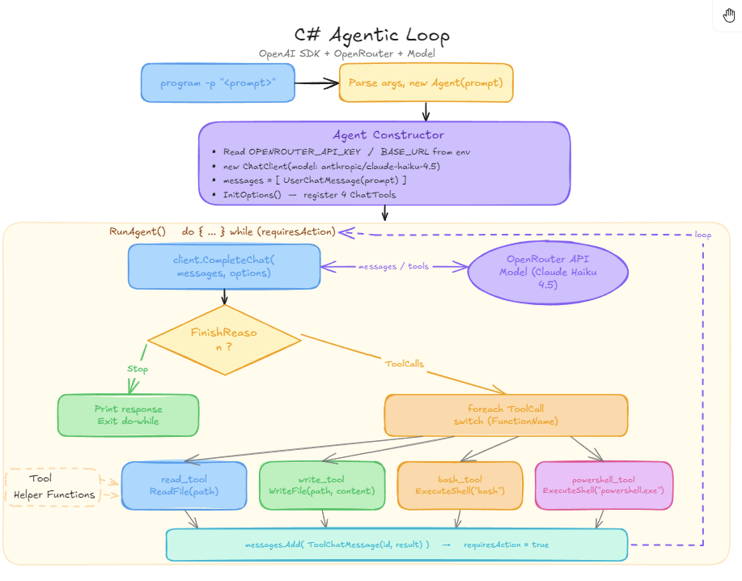

## Overview
This is the Code of my little Site Project to build a Basic CLI Tool which work in the basic sense like the Claude CLI. The Goal of this project was to understand agents better and to take look at what is behind the Buzz words of the AI Marketing.

The Projects uses Open Router to interact with a Model of your choice (the code uses `claude-haiku-4.5` ). Advertises some tools for the Model to use, like reading, writing and executing a Shell Command.


Here is a quick Graphical (Beautiful) Excalidraw  Representation:


## Installation

1. Install Dotnet SDK >= 9.0
2. Clone The Repo
```bash
git clone REPO URL
```
3.  Insert your API Key and Compile the project
```bash
cd "$(dirname "$0")" # Ensure compile steps are run within the repository directory
dotnet build --configuration Release --output /tmp/codecrafters-build-csharp CodeCrafters.ClaudeCode.csproj
```
3. Build the project and execute it with
```
ClaudeCode.exe -p "Read the GUIDE.txt and execute every given Instruction from the File"
```
